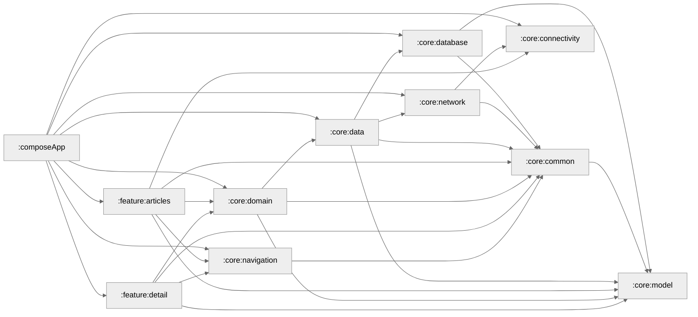

### Module Graph

# Help Articles

A Kotlin Multiplatform app which is scalable, maintainable and testable with modern architecture.
Built with offline-first capabilities using caching, error handling, and background data synchronization.

## Key features
**Modularization** - Loosely coupled and self contained modules with clear separation of concerns.

**Build-logic** - a convention module, which defines a set of plugins that other modules can use to configure themselves. 

**UDF** - Unidirectional Data Flow.

**DI** - Kotlin Inject + Anvil with compile-time code generation via KSP

**Observable Streams** - Kotlin Flow throughout

## Cache & Sync
**Staleness**: 24-hour TTL. Room database as Source of Truth across all platforms except Web. KStore is used on Web.

**Offline-First**: [Store](https://github.com/MobileNativeFoundation/Store) validates cache freshness → fetches if stale → updates DB → emits to UI.

**Background Prefetch**: Pre fetch data periodically in the background to keep cache fresh.

## Design 
https://dribbble.com/shots/26101253-Help-Articles

### Android

  
  

### iOS

  
  

### Desktop

  

### Web

  

## Testing
#### List Screen
**Fresh install + offline**: Uninstall app → disable network → install → shows error

**With cache + offline**: Launch with network → close → disable network → launch → shows cached data

**Detail screen**: Shows data from list screen → loads content markdown → on error shows partial data

#### Detail Screen
**With cache + offline**: Launch with network → close → disable network → launch → open article → shows data

## Trade offs
Background work not yet implemented in Web, JVM, and iOS platforms.

## Libraries
[Kotlin Multiplatform](https://kotlinlang.org/docs/multiplatform.html) (Share logic across platforms)

[Compose Multiplatform](https://www.jetbrains.com/lp/compose-multiplatform/) (Ui Framework)

[Store5](https://mobilenativefoundation.github.io/Store/) (cache management)

[Circuit](https://slackhq.github.io/circuit/) (Navigation/Presentation)

[Ktor](https://ktor.io/) (Networking)

[Room](https://developer.android.com/training/data-storage/room) (Database)

[KStore](https://github.com/xxfast/KStore) (disk storage)

[Kotlin Inject Anvil](https://github.com/amzn/kotlin-inject-anvil) (Dependency Injection) 

[Kotlinx Serialization](https://github.com/Kotlin/kotlinx.serialization) (Serialization)

[Turbine](https://github.com/cashapp/turbine) (Testing)

